# ROWS
> ESP32 tabanlı taşınabilir oyun ve uygulama platformu.

## Açıklama

ROWS, **Arduino Framework** ve **PlatformIO** kullanılarak geliştirilen, birden fazla uygulamayı tek bir firmware içerisinde çalıştırabilen modüler bir ESP32 platformudur. Uygulamalar dosya sisteminden dinamik olarak yüklenmez; derleme sırasında firmware içerisine gömülür.

Amaç, ESP32 üzerinde birden fazla uygulamayı ortak bir yaşam döngüsüyle yönetebilen, OTA güncelleme alabilen, MQTT ile haberleşebilen ve backend servisleriyle birlikte çalışabilen yeniden kullanılabilir bir altyapı oluşturmaktır.

Taşınabilir oyun konsolu, ROWS için geliştirilen ilk kullanım senaryosudur. Bununla birlikte platform yalnızca oyunlarla sınırlı değildir; medya uygulamaları, cihaz yönetim araçları, ağ tabanlı uygulamalar ve farklı gömülü sistem arayüzleri geliştirmek için ortak bir temel sunmayı hedefler.

## Özellikler

### Firmware

- Birden fazla uygulamayı tek firmware içerisinde çalıştırma
- Cihaza özel kimlik, parola ve istemci sertifikası
- 320 × 240 ILI9341 TFT ekran ve LovyanGFX tabanlı çizim altyapısı
- Fiziksel butonlar ve joystickler için merkezi giriş yönetimi
- LittleFS dosya sistemi
- Zamanlayıcı desteği
- WAV dosyası ve nota tabanlı melodi dosyası oynatma
- Wi-Fi ağına bağlanma
- Access Point oluşturma
- Web arayüzü üzerinden Wi-Fi ve Access Point yapılandırması
- mTLS ile korunan OTA firmware güncellemeleri
- MQTT haberleşme desteği

### Backend

- Docker Compose tabanlı servis yönetimi
- Mosquitto MQTT broker
- HTTP tabanlı MQTT kimlik doğrulama ve yetkilendirme servisi
- Firmware sürümlerini yöneten OTA servisi
- Firmware metadata bilgilerini saklayan MySQL veritabanı
- OTA isteklerinde mTLS istemci sertifikası doğrulaması

## Bileşenler

| Bileşen | Miktar | Açıklama |
|---|:---:|---|
| ESP32 DevKitC | 1 | Firmware, ağ, ekran, giriş ve ses işlemlerini yönetir. |
| 2.8" SPI ILI9341 TFT ekran | 1 | Uygulama arayüzünü görüntüler. |
| Hoparlör | 1 | WAV dosyalarını ve melodileri oynatır. |
| PAM8403 amfi modülü | 1 | Hoparlöre aktarılan sesi yükseltir. |
| 3.7V Li-Po batarya | 1 | Cihazın taşınabilir olarak çalışmasını sağlar. |
| TP4056 şarj modülü | 1 | Bataryanın şarj edilmesini sağlar. |
| 5V regülatör | 1 | Devrenin ihtiyaç duyduğu çalışma gerilimini sağlar. |
| Buton | 8 | Yön ve uygulama kontrolleri için kullanılır. |
| Joystick | 2 | Analog yön ve ek uygulama kontrolleri sağlar. |
| Sürgülü anahtar | 2 | Güç ve ses kontrolü için kullanılır. |
| PCB | 1 | Bileşenleri bir araya getirir ve kablo karmaşasını azaltır. |
| 3D yazdırılmış kasa | 1 | Cihazın elektronik bileşenlerini ve kontrol elemanlarını taşır. |

## Kurulum

Repository'yi klonlayın:

```bash
git clone https://github.com/seymenkonuk/ROWS.git
cd ROWS
```

Geliştirme ortamında aşağıdaki araçların bulunması gerekir:

- Visual Studio Code için PlatformIO eklentisi
- Docker ve Docker Compose
- OpenSSL ve Python 3
- Görsel ve melodi dönüştürücüleri için GCC ve Make

## Yapılandırma

### Backend Ayarları

Örnek ortam dosyasını kopyalayın ve veritabanı parolaları gibi değerleri düzenleyin:

```bash
cp backends/.env.example backends/.env
```

### Alan Adı ve Sertifikalar

`tools/ecc-certificate-generator/config/server.cnf` içerisindeki `CN`, `DNS.1` ve `IP.1` değerlerini OTA servisinin çalışacağı alan adı ve IP adresine göre değiştirin.

Aynı adresin aşağıdaki yapılandırmalarla uyumlu olduğundan emin olun:

- `firmware/include/network/OTAService.h`
- `backends/.env`
- Genel DNS yapılandırması

### Firmware Sürümü

Cihazın mevcut sürümü `firmware/data/info/VERSION` dosyasında tutulur. OTA sisteminin çalışabilmesi için firmware sürümü, dosya yolu ve sonraki sürüm ilişkisi backend veritabanında tanımlanmalıdır.

## Kullanım

### Yeni Uygulama Ekleme

Yeni bir uygulama oluşturmak için `IApplication` sınıfından türeyen bir sınıf tanımlayın:

```cpp
class ExampleApp : public IApplication {
public:
  const char *getName() override;
  uint32_t getColor() override;

  void onEnter() override;
  void onExit() override;

  void update(uint32_t deltaTime) override;
  void render() override;
};
```

Uygulama içerisinde:

- `onEnter()` açılış işlemleri için,
- `onExit()` kapanış işlemleri için,
- `update()` giriş ve durum güncellemeleri için,
- `render()` ekran çizimleri için kullanılır.

Ekranın yeniden çizilmesi gerektiğinde `isDirty` değeri `true` yapılmalıdır.

Uygulama sınıfını oluşturduktan sonra bir nesnesini `AppStack.cpp` içerisinde tanımlayın ve sistem ya da kullanıcı uygulamaları listesine ekleyin:

```cpp
static ExampleApp exampleApp;

IApplication *AppStack::usrApps[] = {
    // ...
    &exampleApp,
};
```

Son olarak `SYS_APP_COUNT` veya `USR_APP_COUNT` değerini uygulama sayısına göre güncelleyin.

## Çalıştırma

### 1. Cihaz Kimliği ve Sertifikaları Oluşturma

İlk kurulumda Root CA, sunucu sertifikası ve ilk cihaz kimliğini oluşturun:

```bash
cd tools/ecc-certificate-generator
chmod +x generate.sh create_password.sh create_serial_number.sh
./generate.sh reset
cd ../..
```

Yeni bir cihaz eklerken mevcut Root CA altyapısını korumak için yalnızca şu komutu kullanın:

```bash
cd tools/ecc-certificate-generator
./generate.sh
cd ../..
```

### 2. Backend Servislerini Başlatma

```bash
cd backends
docker compose up -d --build
cd ..
```

### 3. Asset Dosyalarını Hazırlama

Görselleri `.rif`, melodileri `.rmf` formatına dönüştürerek ilgili uygulamanın `firmware/data/programs/` altındaki dizinine yerleştirin.

Ayrıntılı kullanım için:

- [Image Converter](tools/image-converter/README.md)
- [Melody Converter](tools/melody-converter/README.md)

### 4. Dosya Sistemini ve Firmware'i Yükleme

ESP32'yi bilgisayara bağladıktan sonra:

```bash
cd firmware
pio run -t uploadfs
pio run -t upload
```

Seri port çıktısını görüntülemek için:

```bash
pio device monitor
```

Cihaz ilk açılışta `ROWS-<SERİ_NUMARASI>` adıyla bir Access Point oluşturur. Web arayüzüne varsayılan olarak `192.168.4.1` adresinden erişilebilir. Kullanıcı adı cihazın seri numarası, parola ise sertifika aracı tarafından oluşturulan cihaz parolasıdır.

## Galeri

<table>  
  <tr>
    <td align="center" width="25%">
      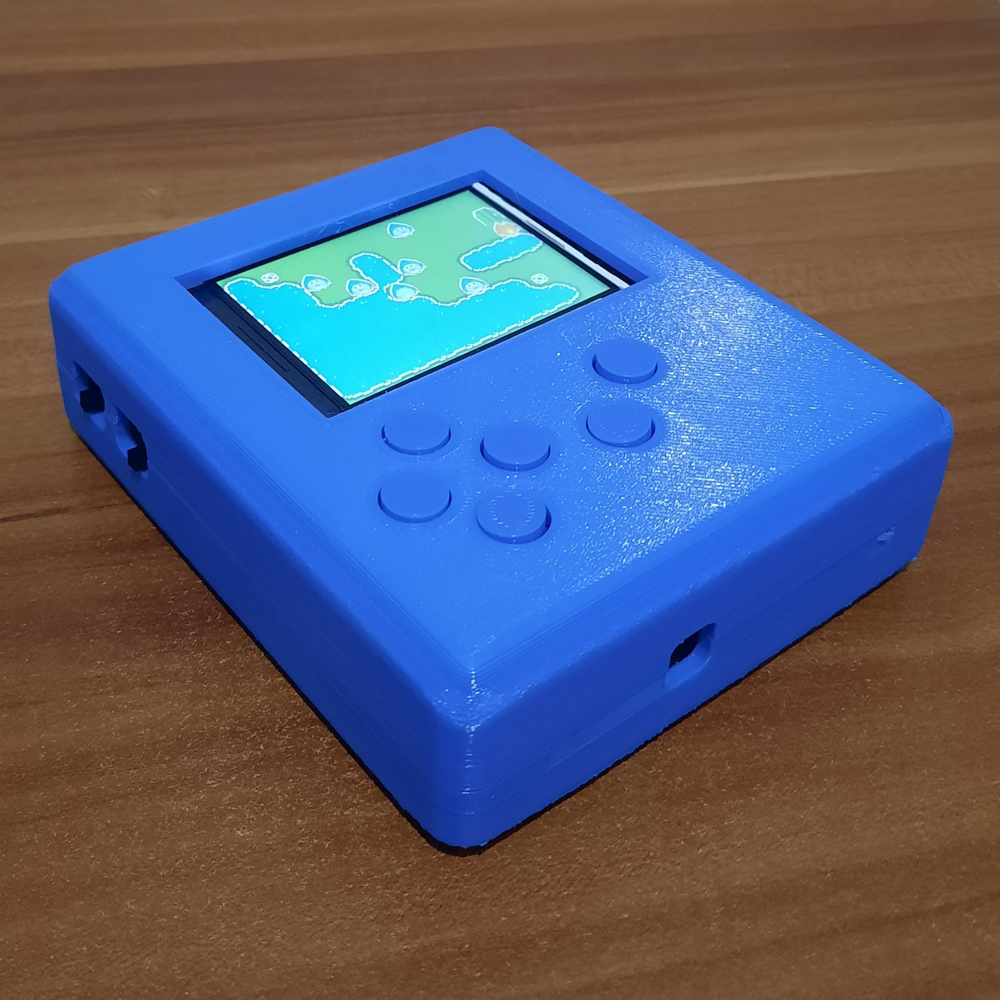<br>
      <sub><b>Cihaz</b></sub>
    </td>
    <td align="center" width="25%">
      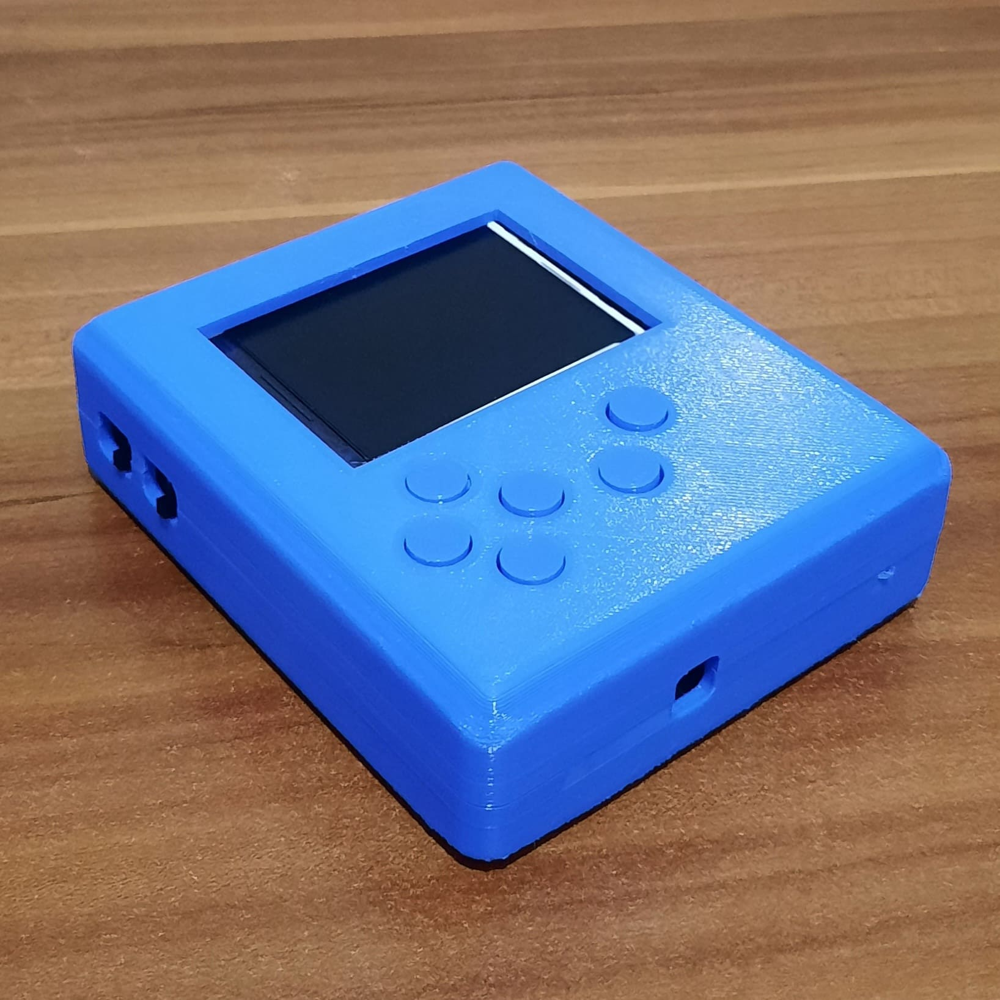<br>
      <sub><b>Kasa tasarımı</b></sub>
    </td>
    <td align="center" width="25%">
      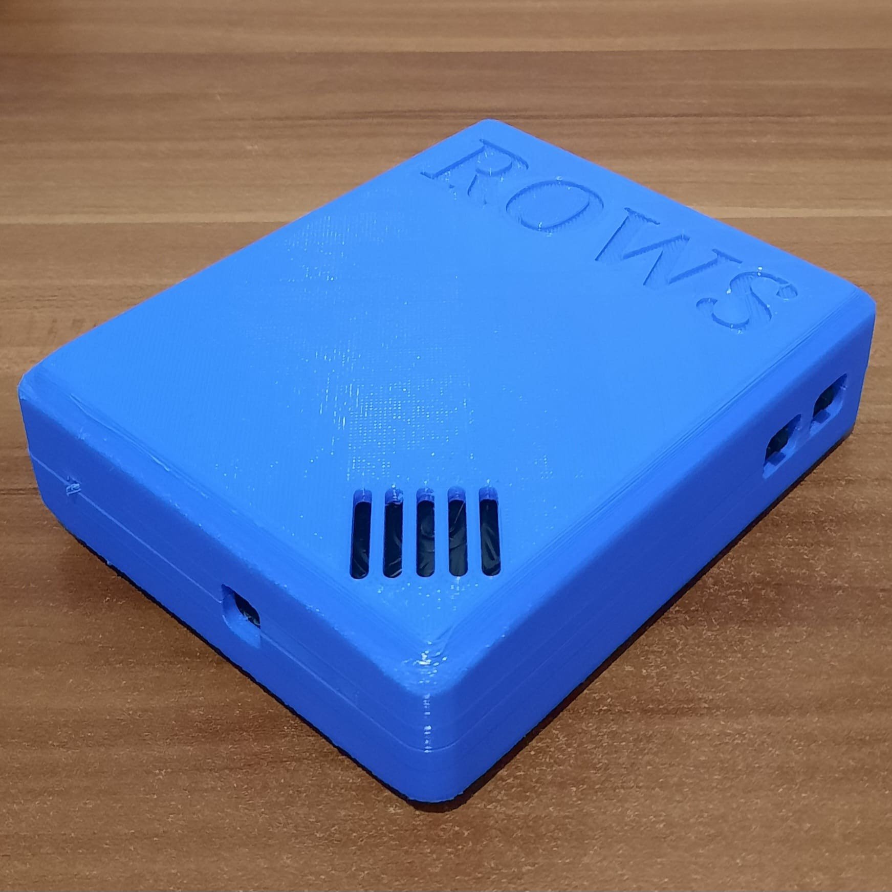<br>
      <sub><b>Kasanın arka görünümü</b></sub>
    </td>
    <td align="center" width="25%">
      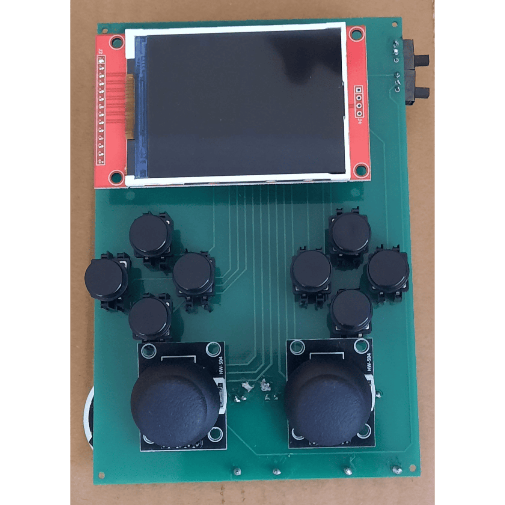<br>
      <sub><b>PCB tabanlı yeni sürüm</b></sub>
    </td>
  </tr>
  <tr>
    <td align="center" width="25%">
      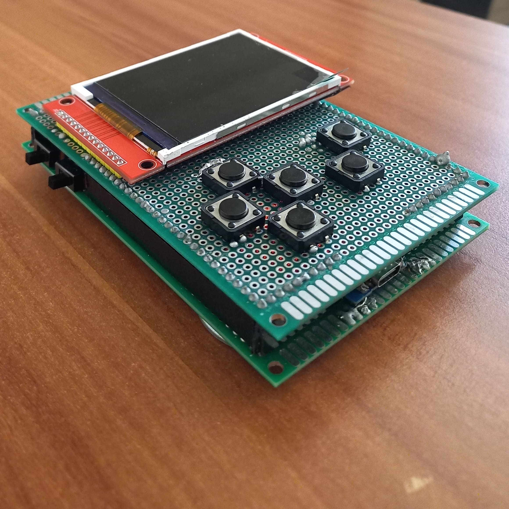<br>
      <sub><b>Prototip</b></sub>
    </td>
    <td align="center" width="25%">
      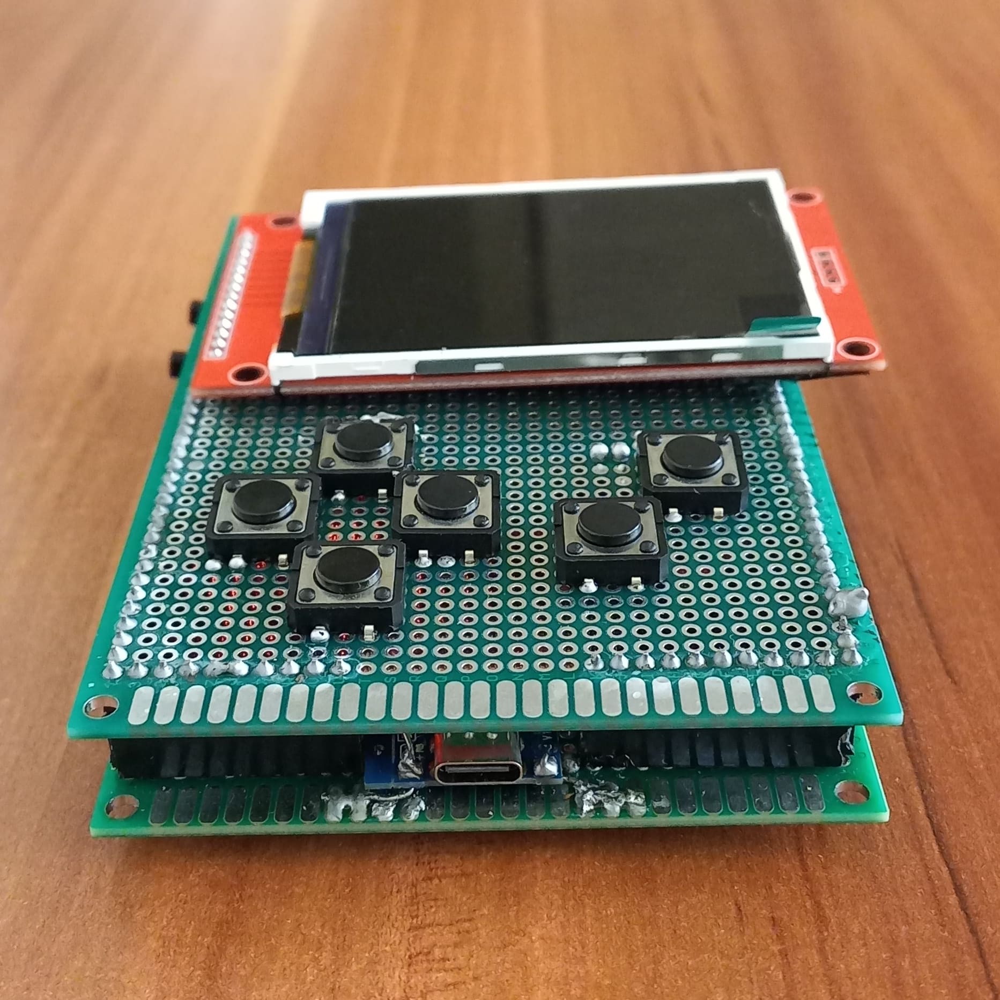<br>
      <sub><b>Prototip (Önden)</b></sub>
    </td>
    <td align="center" width="25%">
      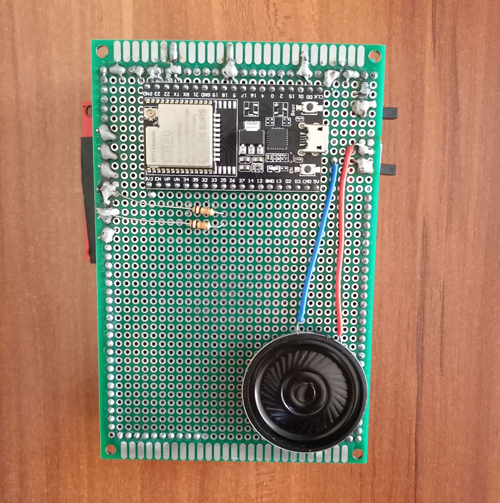<br>
      <sub><b>Prototipin arkası</b></sub>
    </td>
    <td align="center" width="25%">
      <br>
      <sub><b>Prototipin iç yapısı</b></sub>
    </td>
  </tr>
  <tr>
    <td align="center" width="25%">
      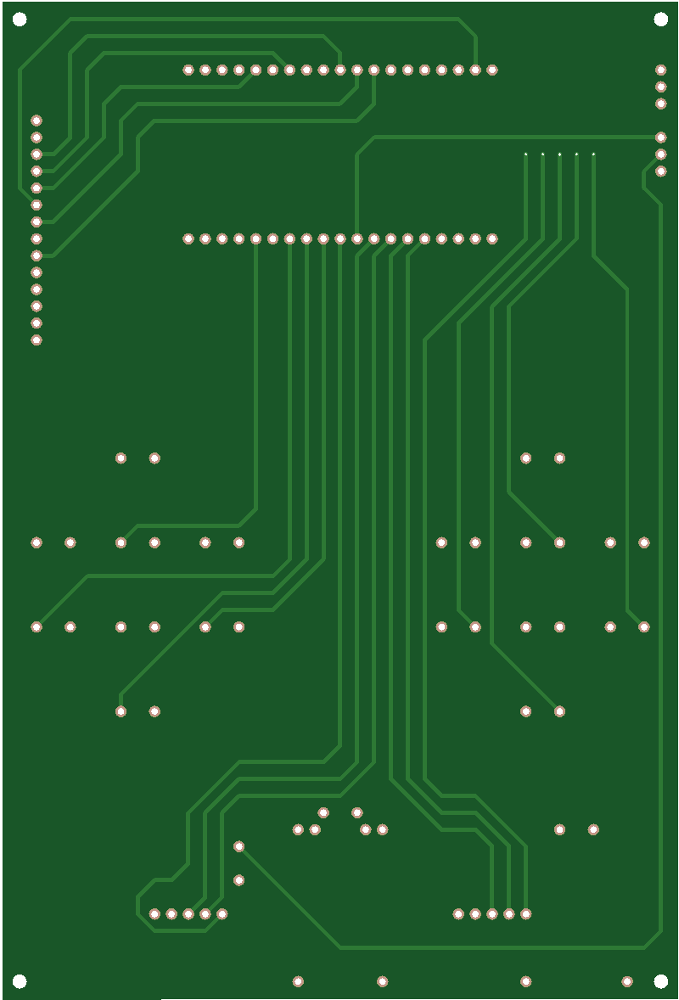<br>
      <sub><b>PCB üst katmanı</b></sub>
    </td>
    <td align="center" width="25%">
      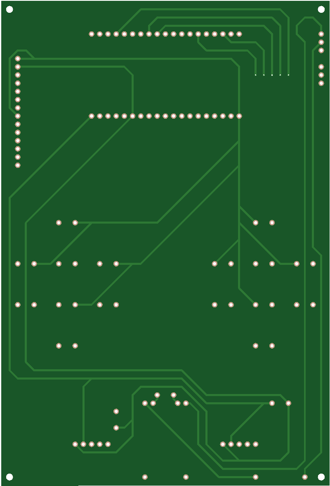<br>
      <sub><b>PCB alt katmanı</b></sub>
    </td>
    <td align="center" width="25%">
      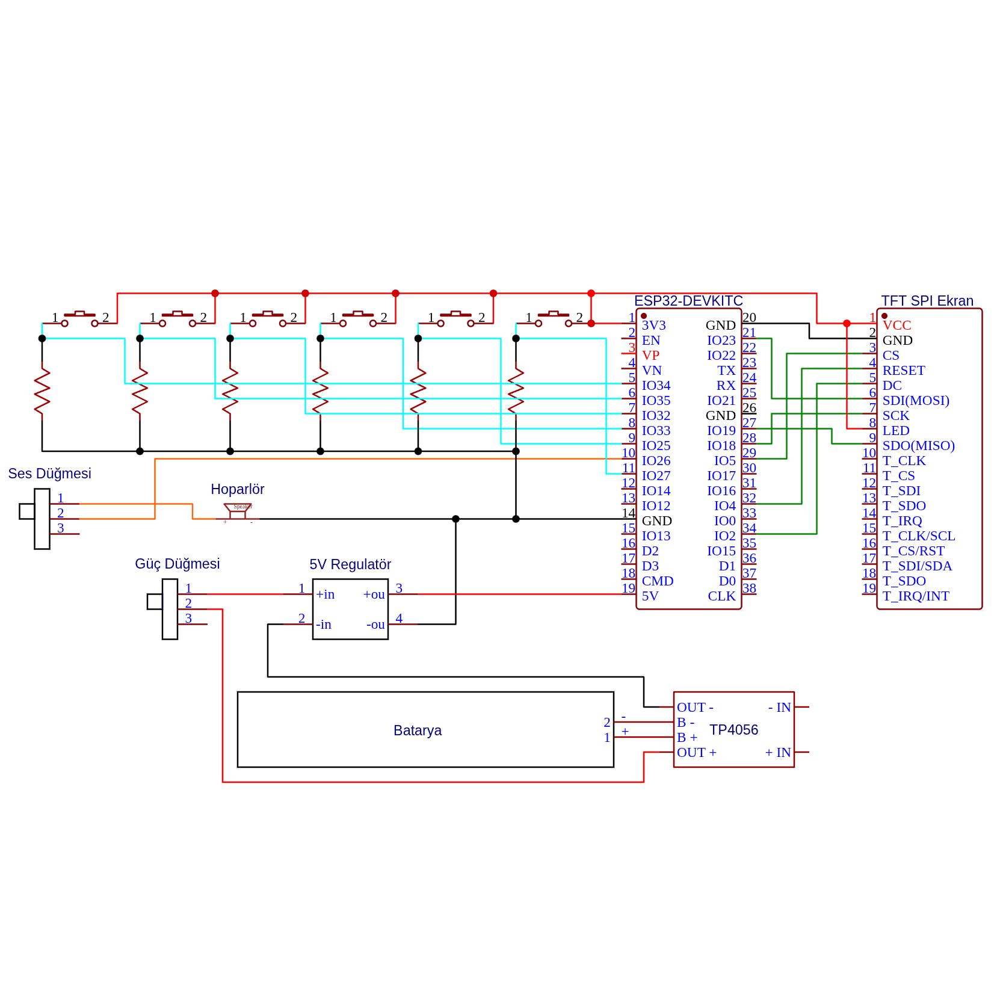<br>
      <sub><b>Bağlantı şeması</b></sub>
    </td>
    <td align="center" width="25%">
      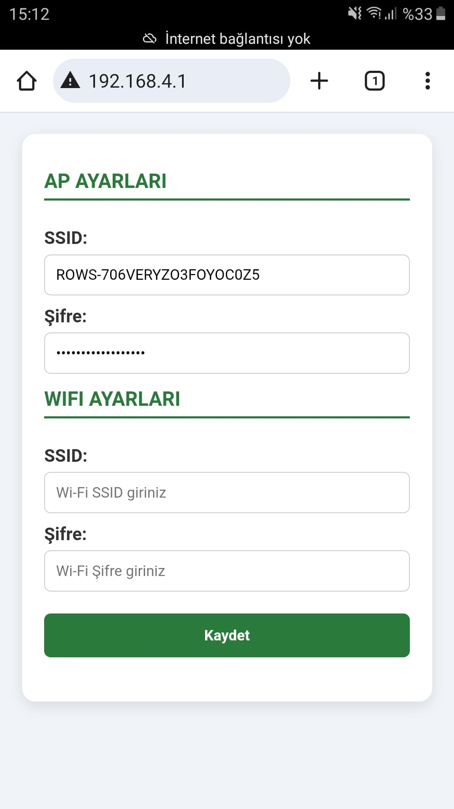<br>
      <sub><b>Wi-Fi yapılandırma arayüzü</b></sub>
    </td>
  </tr>
</table>

## Örnek Oyun
Bu oyun, “Ateş” karakterini yönlendirerek tüm paraları toplamayı ve suya temas etmeden en kısa yoldan çıkış kapısına ulaşmayı hedefler.

Oyun alanında iki zemin türü bulunur:
- **Orman**: Serbestçe yürüyebileceğin güvenli alanlar.
- **Buz**: Üzerinden geçtikçe eriyen ve bir daha adım atılamayan zeminler.

[[Oynanış Videosu]](https://github.com/user-attachments/assets/27f34f8b-76a2-4102-bd1e-3fae5ff327b1)


## Gelecek Planları

- [X] Cihaz içerisine Ayarlar uygulaması eklenmesi
- [ ] Yazılımsal 3D render desteği
- [ ] Yerel ve çevrim içi multiplayer desteği
- [ ] Daha fazla sistem ve kullanıcı uygulamaları
- [ ] Cihaz içerisine Uygulama Mağazası eklenmesi

> 💡 **Not:** Uygulama mağazasından bir uygulama seçildiğinde, sunucunun cihaza özel yeni bir firmware oluşturması ve bunu OTA güncellemesi olarak göndermesi planlanmaktadır.

## Lisans

Bu proje [MIT Lisansı](https://github.com/seymenkonuk/ROWS/blob/main/LICENSE) ile lisanslanmıştır.
